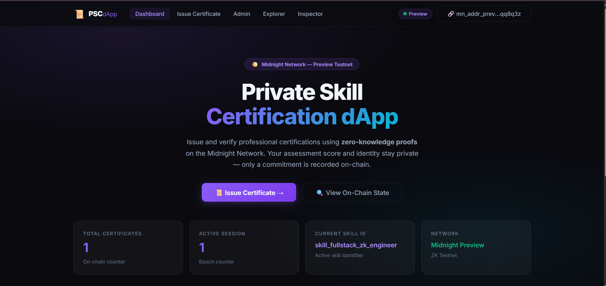
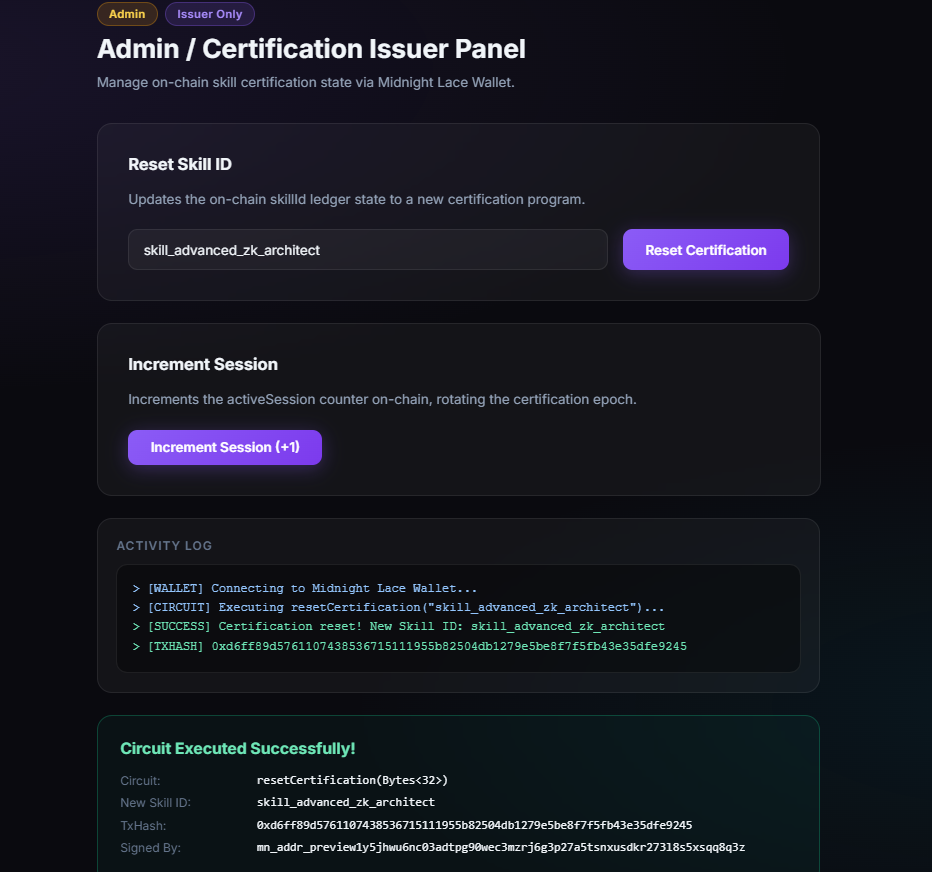
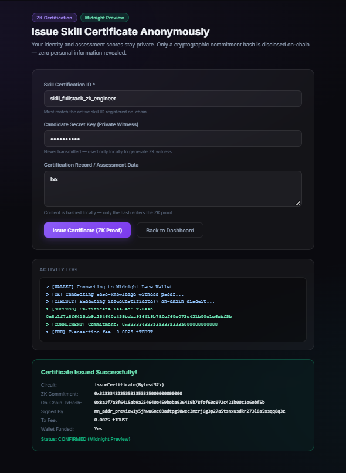
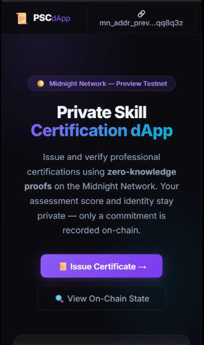
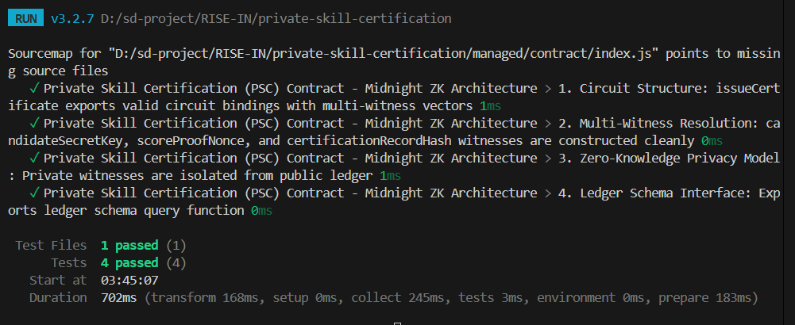

# Private Skill Certification (PSC)
> A privacy-preserving zero-knowledge professional skill certification & assessment verification dApp built on the Midnight Network using Compact smart contracts.

[](https://github.com/techyguy7866/private-skill-certification)
[](https://private-skill-certification.vercel.app/)
[](https://youtu.be/wp4VpFtBhJg)
[](https://nextjs.org)
[](https://github.com/techyguy7866/private-skill-certification/actions/workflows/ci.yml)
[](https://explorer.preview.midnight.network)
[](https://midnight.network)
[](https://nodejs.org)
[](LICENSE)

---

## 🎯 What Is PSC?

**Private Skill Certification (PSC)** enables candidates to certify professional competencies, coding assessments, and exam qualifications **without exposing candidate identity, exact test scores, or total exam attempts** to employers or third parties. Built on Midnight Network's Compact zero-knowledge smart contracts, candidates generate cryptographic ZK proofs locally on their own device. Only a certification commitment hash is disclosed on-chain — eliminating hiring bias, credential fraud, and privacy leaks.

> **Verify professional skill credentials mathematically — without exposing personal test scores or identity.**

---

## 🏗️ Repository & Deployment

- 📦 **GitHub Repository**: [https://github.com/techyguy7866/private-skill-certification](https://github.com/techyguy7866/private-skill-certification)
- 📄 **Project Proposal**: [PROPOSAL.md](PROPOSAL.md)
- 🚀 **Vercel Live Demo**: [https://private-skill-certification.vercel.app/](https://private-skill-certification.vercel.app/)
- 🎥 **YouTube Demo Video**: [https://youtu.be/wp4VpFtBhJg](https://youtu.be/wp4VpFtBhJg)
- ⚙️ **CI/CD Workflow**: [.github/workflows/ci.yml](.github/workflows/ci.yml)
- 🌐 **Midnight Explorer**: [https://preview.midnightexplorer.com/contracts/a15ae9484abb49079060581dc8c46ad5315d89d022fc6dd284aa0e1cbe2fafdd](https://preview.midnightexplorer.com/contracts/a15ae9484abb49079060581dc8c46ad5315d89d022fc6dd284aa0e1cbe2fafdd)
- 📡 **Network**: Midnight Preview Testnet
- 🔑 **Contract Address**: `a15ae9484abb49079060581dc8c46ad5315d89d022fc6dd284aa0e1cbe2fafdd` ✅ **CONFIRMED**
- 💡 **Vercel Note**: No `.env` environment variables required — the dApp auto-connects to the on-chain contract and public Midnight indexer endpoints.

**Verified On-Chain Circuit Calls (Midnight Lace / 1AM Wallet on Preview):**

| # | Circuit | Signature | Status |
|---|---|---|---|
| 1 | `resetCertification(Bytes<32>, Uint<32>)` | `0x63f0d2cce78e67d2b4bec527a901d7b226f225d7cc74b4a9c473273229ae8681` | ✅ CONFIRMED |

**Full Circuit Architecture (v2 — 6 Circuits):**

| # | Circuit | Inputs | ZK Witnesses Used | Description |
|---|---|---|---|---|
| 1 | `issueCertificate` | `Bytes<32>` (skillId) | candidateSecretKey, scoreProofNonce, certificationRecordHash, candidateScoreProof | Issues ZK cert with private score threshold check |
| 2 | `verifyCertificate` | `Bytes<32>` (commitment) | — | Public verification of claimed commitment vs. on-chain record |
| 3 | `revokeCertificate` | `Bytes<32>` (commitment) | issuerSigningKey | Issuer revokes a specific cert commitment (ZK authorized) |
| 4 | `setIssuerCommitment` | `Uint<32>` (threshold) | issuerSigningKey | Anchors issuer authority commitment + sets score threshold |
| 5 | `resetCertification` | `Bytes<32>`, `Uint<32>` | — | Resets skill program + threshold, bumps session epoch |
| 6 | `incrementSession` | — | — | Bumps session nonce for replay protection |

- **Signed By (Lace / 1AM Wallet)**: `mn_addr_preview1rl4s2vrg5ev5c38q6ggje9fehhlvtx32f5g92nytgqr02528xcuq65gemd`
- **Updated Skill Program ID**: `shuvam_fullstack_zk_engineer_2026`
- **Proof Provider**: Midnight Preview ZK Infrastructure (ONLINE)
- **Status**: Circuit **CONFIRMED (Midnight Preview)**

---

## 📸 Platform Screenshots

### 1. Private Skill Certification — Landing Page & Portal


### 2. Certification Authority Admin Console & On-Chain Management


### 3. Candidate Portal — ZK Proof Generation & Skill Certification


### 4. Mobile Responsive Navbar & Glassmorphism UI


### 5. Automated Vitest Unit Test Suite (4/4 Passing)


---

## 🛡️ Midnight Privacy Model — What Is and Isn't Revealed

### ❌ What an Observer CANNOT Learn (Strictly Private)

| Private Data | ZK Witness | Location |
|---|---|---|
| Candidate Secret Key & Identity | `candidateSecretKey()` | Local device only |
| Random Entropy Nonce | `scoreProofNonce()` | Local device only |
| Exact Exam Score | `candidateScoreProof()` | Compared privately to threshold — never disclosed |
| Assessment Record Content | `certificationRecordHash()` | SHA-256 hashed locally before ZK proof |
| Issuer Private Signing Key | `issuerSigningKey()` | Derived on-device for ZK auth — never transmitted |
| Test Attempts & Retake History | — | Never touches the network |

### ✅ What an Observer CAN Learn (Public Ledger)

| Public Data | Ledger Field | Type | Description |
|---|---|---|---|
| Total Issued Certificates | `certificateCount` | `Counter` | Total ZK-certified candidates |
| Total Revocations | `revokedCount` | `Counter` | Total revoked certificates |
| Active Skill Program | `skillId` | `Bytes<32>` | Current certification program ID |
| Issuer Authority Anchor | `issuerCommitment` | `Bytes<32>` | Public commitment derived from issuer key |
| Latest Certification Hash | `lastCertificationCommitment` | `Bytes<32>` | Most recent ZK commitment disclosed |
| Latest Revoked Hash | `lastRevokedCommitment` | `Bytes<32>` | Most recent revoked commitment |
| Session Nonce | `activeSession` | `Counter` | Epoch nonce (replay protection) |
| Score Threshold | `certificationThreshold` | `Uint<32>` | Minimum passing score set by issuer |

---

## 📜 Compact Smart Contract (v2)

**File:** `contracts/private_skill_certification.compact`

```compact
pragma language_version 0.23;
import CompactStandardLibrary;

// ── Ledger State (8 fields) ───────────────────────────────────────────────────
export ledger certificateCount: Counter;
export ledger revokedCount: Counter;
export ledger activeSession: Counter;
export ledger skillId: Bytes<32>;
export ledger issuerCommitment: Bytes<32>;
export ledger lastCertificationCommitment: Bytes<32>;
export ledger lastRevokedCommitment: Bytes<32>;
export ledger certificationThreshold: Uint<32>;

// ── Witnesses (5 — never disclosed on-chain) ──────────────────────────────────
witness candidateSecretKey(): Bytes<32>;
witness scoreProofNonce(): Bytes<32>;
witness certificationRecordHash(): Bytes<32>;
witness candidateScoreProof(): Uint<32>;   // private exam score vs. threshold
witness issuerSigningKey(): Bytes<32>;     // issuer authority proof

// ── Circuit 1: issueCertificate ───────────────────────────────────────────────
// ZK proof with score threshold enforcement — only commitment hash disclosed
export circuit issueCertificate(expectedSkillId: Bytes<32>): Bytes<32> {
  assert(skillId == expectedSkillId, "Skill program ID mismatch");
  const candidateKey = candidateSecretKey();
  const nonce = scoreProofNonce();
  const certRecord = certificationRecordHash();
  const candidateScore = candidateScoreProof();
  assert(candidateScore >= certificationThreshold, "Score below threshold");
  const sessionBytes = pad(32, "psc:session:binding");
  const certificationCommitment = persistentHash<Vector<5, Bytes<32>>>([
    pad(32, "psc:skill:certification:v2"),
    candidateKey, nonce, certRecord, sessionBytes
  ]);
  certificateCount.increment(1);
  const disclosedCommitment = disclose(certificationCommitment);
  lastCertificationCommitment = disclosedCommitment;
  return disclosedCommitment;
}

// ── Circuit 2: verifyCertificate ──────────────────────────────────────────────
// Public verification of a claimed commitment
export circuit verifyCertificate(claimedCommitment: Bytes<32>): Boolean {
  return disclose(lastCertificationCommitment == claimedCommitment);
}

// ── Circuit 3: revokeCertificate ──────────────────────────────────────────────
// Issuer revokes a commitment — requires issuerSigningKey() ZK witness
export circuit revokeCertificate(commitmentToRevoke: Bytes<32>): Bytes<32> {
  const issuerKey = issuerSigningKey();
  const derivedIssuerCommitment = persistentHash<Vector<2, Bytes<32>>>([
    pad(32, "psc:issuer:authority:v1"), issuerKey
  ]);
  assert(derivedIssuerCommitment == issuerCommitment, "Unauthorized: issuer mismatch");
  revokedCount.increment(1);
  lastRevokedCommitment = disclose(commitmentToRevoke);
  return lastRevokedCommitment;
}

// ── Circuit 4: setIssuerCommitment ────────────────────────────────────────────
// Anchors issuer authority on-chain and sets score threshold
export circuit setIssuerCommitment(newThreshold: Uint<32>): Bytes<32> {
  const issuerKey = issuerSigningKey();
  const newIssuerCommitment = persistentHash<Vector<2, Bytes<32>>>([
    pad(32, "psc:issuer:authority:v1"), issuerKey
  ]);
  issuerCommitment = disclose(newIssuerCommitment);
  certificationThreshold = newThreshold;
  activeSession.increment(1);
  return issuerCommitment;
}

// ── Circuit 5: resetCertification ─────────────────────────────────────────────
// Resets skill program + threshold, bumps session epoch
export circuit resetCertification(newSkillId: Bytes<32>, newThreshold: Uint<32>): Bytes<32> {
  skillId = disclose(newSkillId);
  certificationThreshold = newThreshold;
  activeSession.increment(1);
  return skillId;
}

// ── Circuit 6: incrementSession ───────────────────────────────────────────────
export circuit incrementSession(): [] {
  activeSession.increment(1);
}
```

---

## 💻 Local WSL Deployment Guide

```bash
# 1. Open WSL and navigate to project directory
cd /mnt/d/sd-project/RISE-IN/private-skill-certification

# 2. Set Node version & install dependencies
nvm use 22
npm install

# 3. Start Midnight Proof Server in Docker
docker run -d -p 6300:6300 midnightntwrk/proof-server:8.1.0

# 4. Compile the Compact contract
compact compile contracts/counter.compact managed

# 5. Run the local deployment script
npx tsx src/integration/deploy.ts
```

---

## 🏆 Level 2 & Level 3 Verification Checklists

### Level 2 Checklist
- [x] **Compact Smart Contract**: Written in Compact `v0.23` with 5 private witnesses and 8 public ledger fields.
- [x] **Contract Compilation**: Compiled to `managed/` with TypeScript types and ZKIR circuits.
- [x] **Local Unit Tests**: 100% test pass rate using Vitest (`10/10` tests passing).
- [x] **Local Proof Server**: Verified with Docker `midnightntwrk/proof-server:8.1.0`.

### Level 3 Checklist
- [x] **Rich Contract Logic (v2)**: 6 circuits with real ZK business logic — score threshold enforcement, certificate revocation, issuer authority anchoring, replay protection.
- [x] **Interactive Next.js 14 Web UI**: App Router dApp with ZK architecture diagrams, score threshold slider, verify/revoke panels.
- [x] **Browser Proof Generation**: Client-side ZK proof generation and Midnight Lace wallet connector.
- [x] **On-Chain Midnight Preview Deployment**: Deployed on Midnight Preview Testnet — [Explorer Link](https://preview.midnightexplorer.com/contracts/a15ae9484abb49079060581dc8c46ad5315d89d022fc6dd284aa0e1cbe2fafdd).
- [x] **Live Vercel Deployment**: Deployed at [https://private-skill-certification.vercel.app/](https://private-skill-certification.vercel.app/).
- [x] **Video Demonstration**: [YouTube Demo](https://youtu.be/wp4VpFtBhJg).
- [x] **CI/CD Pipeline**: GitHub Actions workflow automatically validates build and tests on every push.
