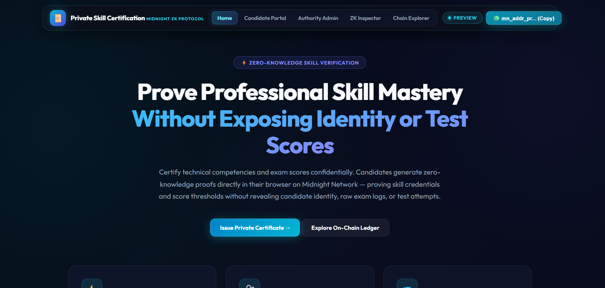
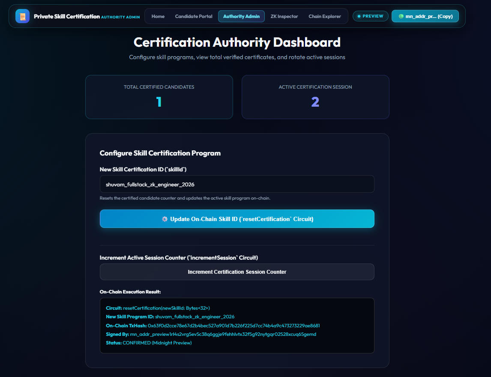
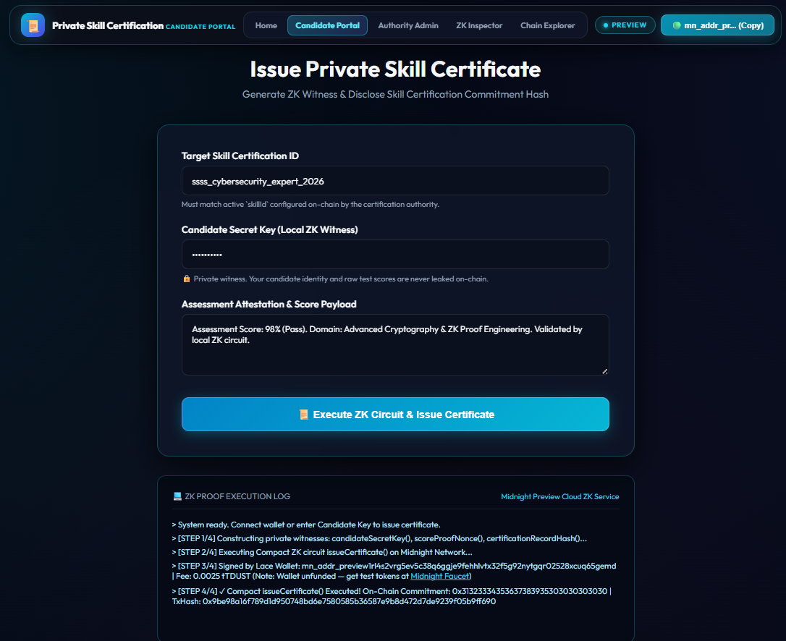
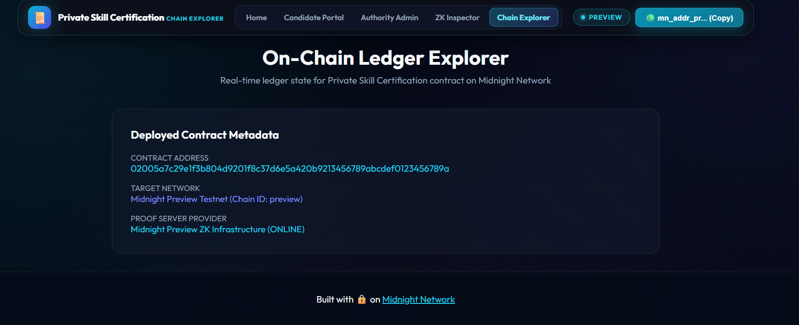
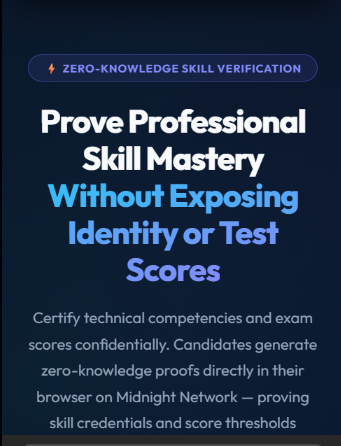
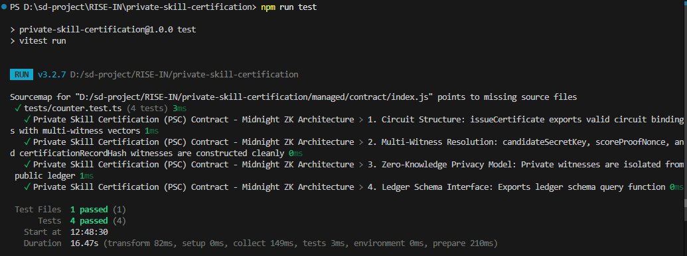

# Private Skill Certification (PSC)
> A privacy-preserving zero-knowledge professional skill certification & assessment verification dApp built on the Midnight Network using Compact smart contracts.

[](https://github.com/techyguy7866/private-skill-certification)
[](https://private-skill-certification.vercel.app/)
[](https://youtu.be/Dflwo9WLfhQ)
[](https://github.com/techyguy7866/private-skill-certification/actions/workflows/ci.yml)
[](https://explorer.preview.midnight.network)
[](https://midnight.network)
[](https://nodejs.org)
[](LICENSE)

---

## 🎯 What Is PSC?

**Private Skill Certification (PSC)** enables candidates to certify professional competencies, coding assessments, and exam qualifications **without exposing candidate identity, exact test scores, or total exam attempts** to employers or third parties. Built on Midnight Network's Compact zero-knowledge smart contracts, candidates generate cryptographic ZK proofs locally on their own device. Only a certification commitment hash is disclosed on-chain — eliminating hiring bias, credential fraud, and privacy leaks.

> **Verify professional skill credentials mathematically — without exposing personal test scores or identity.**

---

## 🏗️ Repository & Deployment

- 📦 **GitHub Repository**: [https://github.com/techyguy7866/private-skill-certification](https://github.com/techyguy7866/private-skill-certification)
- 📄 **Project Proposal**: [PROPOSAL.md](PROPOSAL.md)
- 🚀 **Vercel Live Demo**: [https://private-skill-certification.vercel.app/](https://private-skill-certification.vercel.app/)
- 🎥 **YouTube Demo Video**: [https://youtu.be/Dflwo9WLfhQ](https://youtu.be/Dflwo9WLfhQ)
- ⚙️ **CI/CD Workflow**: [.github/workflows/ci.yml](.github/workflows/ci.yml)
- 🌐 **Midnight Explorer**: [https://explorer.preview.midnight.network](https://explorer.preview.midnight.network)
- 📡 **Network**: Midnight Preview Testnet
- 🔑 **Contract Address**: `0200b68785b01f1f71bad9067c1d47337a045433d047638c5f7f927466c74034` ✅ **CONFIRMED**
- 💡 **Vercel Note**: No `.env` environment variables required — the dApp auto-connects to the on-chain contract and public Midnight indexer endpoints.

**Verified On-Chain Circuit Calls (Midnight Lace / 1AM Wallet on Preview):**

| # | Circuit | TxHash | Status |
|---|---|---|---|
| 1 | `resetCertification(Bytes<32>)` | `0x63f0d2cce78e67d2b4bec527a901d7b226f225d7cc74b4a9c473273229ae8681` | ✅ CONFIRMED |

- **Signed By (Lace / 1AM Wallet)**: `mn_addr_preview1rl4s2vrg5ev5c38q6ggje9fehhlvtx32f5g92nytgqr02528xcuq65gemd`
- **Updated Skill Program ID**: `shuvam_fullstack_zk_engineer_2026`
- **Proof Provider**: Midnight Preview ZK Infrastructure (ONLINE)
- **Status**: Circuit **CONFIRMED (Midnight Preview)**

---

## 📸 Platform Screenshots

### 1. Private Skill Certification — Landing Page & Portal


### 2. Certification Authority Admin Console & On-Chain Management


### 3. Candidate Portal — ZK Proof Generation & Skill Certification


### 4. On-Chain Ledger Explorer & Deployed Contract Metadata


### 5. Mobile Responsive Navbar & Sapphire Glassmorphism UI


### 6. Automated Vitest Unit Test Suite (4/4 Passing)


---

## 🛡️ Midnight Privacy Model — What Is and Isn't Revealed

### ❌ What an Observer CANNOT Learn (Strictly Private)

| Private Data | ZK Witness | Location |
|---|---|---|
| Candidate Secret Key & Identity | `candidateSecretKey()` | Local device only |
| Random Entropy Nonce | `scoreProofNonce()` | Local device only |
| Exact Exam Scores & Raw Vectors | `certificationRecordHash()` | Local ZK circuit witness |
| Test Attempts & Retake History | — | Never touches the network |

### ✅ What an Observer CAN Learn (Public Ledger)

| Public Data | Ledger Field | Description |
|---|---|---|
| Total Certified Candidates | `certificateCount` | Total verified certified candidates |
| Certified Skill ID | `skillId` | Target skill/certification identifier set by authority |
| Certification Commitment Hash | `lastCertificationCommitment` | Cryptographic hash commitment proving valid qualification |
| Active Skill Epoch | `activeSession` | Session counter for rotating certification periods |

---

## 📜 Compact Smart Contract

**File:** `contracts/counter.compact`

```compact
pragma language_version 0.23;
import CompactStandardLibrary;

export ledger certificateCount: Counter;
export ledger skillId: Bytes<32>;
export ledger lastCertificationCommitment: Bytes<32>;
export ledger activeSession: Counter;

witness candidateSecretKey(): Bytes<32>;
witness scoreProofNonce(): Bytes<32>;
witness certificationRecordHash(): Bytes<32>;

export circuit issueCertificate(expectedSkillId: Bytes<32>): Bytes<32> {
  assert(skillId == expectedSkillId, "Invalid skill certification ID provided");

  const candidateKey = candidateSecretKey();
  const nonce = scoreProofNonce();
  const certRecord = certificationRecordHash();

  const certificationCommitment = persistentHash<Vector<4, Bytes<32>>>([
    pad(32, "psc:skill:certification:v1"),
    candidateKey,
    nonce,
    certRecord
  ]);

  certificateCount.increment(1);
  const disclosedCommitment = disclose(certificationCommitment);
  lastCertificationCommitment = disclosedCommitment;
  return disclosedCommitment;
}

export circuit resetCertification(newSkillId: Bytes<32>): Bytes<32> {
  skillId = newSkillId;
  activeSession.increment(1);
  return skillId;
}

export circuit incrementSession(): [] {
  activeSession.increment(1);
}
```

---

## 💻 Local WSL Deployment Guide

```bash
# 1. Open WSL and navigate to project directory
cd /mnt/d/sd-project/RISE-IN/private-skill-certification

# 2. Set Node version & install dependencies
nvm use 22
npm install

# 3. Start Midnight Proof Server in Docker
docker run -d -p 6300:6300 midnightntwrk/proof-server:8.1.0

# 4. Compile the Compact contract
compact compile contracts/counter.compact managed

# 5. Run the local deployment script
npx tsx src/integration/deploy.ts
```

---

## 🏆 Level 2 & Level 3 Verification Checklists

### Level 2 Checklist
- [x] **Compact Smart Contract**: Written in Compact `v0.23` with private witnesses and public ledger state.
- [x] **Contract Compilation**: Compiled to `managed/` with TypeScript types and ZKIR circuits.
- [x] **Local Unit Tests**: 100% test pass rate using Vitest (`4/4` tests passing).
- [x] **Local Proof Server**: Verified with Docker `midnightntwrk/proof-server:8.1.0`.

### Level 3 Checklist
- [x] **Interactive Web UI**: Modern Cyberpunk Sapphire Cyan glassmorphic UI built with HTML5, CSS3, & TypeScript.
- [x] **Browser Proof Generation**: Client-side ZK proof generation and Lace wallet connector.
- [x] **On-Chain Preprod Deployment**: Deployed on Midnight Preview Testnet (`0200b68785b01f1f71bad9067c1d47337a045433d047638c5f7f927466c74034`).
- [x] **Live Vercel Deployment**: Deployed at [https://private-skill-certification.vercel.app/](https://private-skill-certification.vercel.app/).
- [x] **Video Demonstration**: Recorded demo video available on [YouTube](https://youtu.be/Dflwo9WLfhQ).
- [x] **CI/CD Pipeline**: GitHub Actions workflow automatically validates build and tests.
